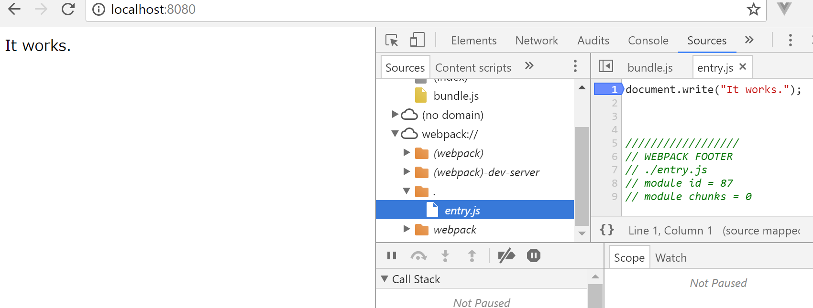

# watch モードと開発用サーバー
JavaScript ファイルを保存するたびに `webpack` コマンドをたたくのはとても面倒です。その時に便利な、watch モードと、webpack-dev-server を使ってみます。

watch モードとは、ファイルの変更を検出して自動でビルドをするモードです。`些細な機能に見えるかもしれませんが、使ってみるとかなり便利です。

webpack-dev-server は開発用のウェブサーバーで、watch モードのような自動ビルドに加えて、ブラウザーの再起動やその他開発に便利な機能を提供します。

各ファイルは [Lesson 2](../lesson2) のものと同じです。


## watch モード
watch モードを使うには `--watch` をつけて webpack を実行してください。

```
webpack --watch
```

`--watch` すら面倒な人は `-w` をば!

```
webpack -w
```

[entry.js](./entry.js) ファイルを保存するたびにビルドが走るのがわかると思います。

あきたら `CTRL + C` で停止してください。


## webpack-dev-server
まずはインストールをします。

```
npm install -g webpack-dev-server
```

webpack の代わりに webpack-dev-server を実行します。

```
webpack-dev-server --open
```

ファイルを保存するだけで、ビルドされブラウザーのリロードまで自動でやってくれます! 超便利!

`--open` はデフォルトブラウザーを開く設定です。


## おまけ
### webpack-dev-server で Source Map
JacaScript をデバッグしようにも webpack が作成した [bundle.js](./bundle.js) をデバッグするのはかなり大変です。デバッグはオリジナルの [entry.js](./entry.js) でやりたいですよね? そこで Source Map の出番です。webpack-dev-server はこの Source Map を簡単に扱えます。

[webpack.config.json](./webpack.config.js) に `devtool: 'inline-source-map'` を追加します。

```javascript
module.exports = {
  entry: './entry.js',
  output: {
    path: __dirname,
    filename: 'bundle.js',
  },
  devtool: 'inline-source-map',
};
```

もう一度、webpack-dev-server を立ち上げなおしてください。

ブラウザーのインスペクションツールでオリジナルのファイルを見ることができます。もちろんデバッガも使えます。

